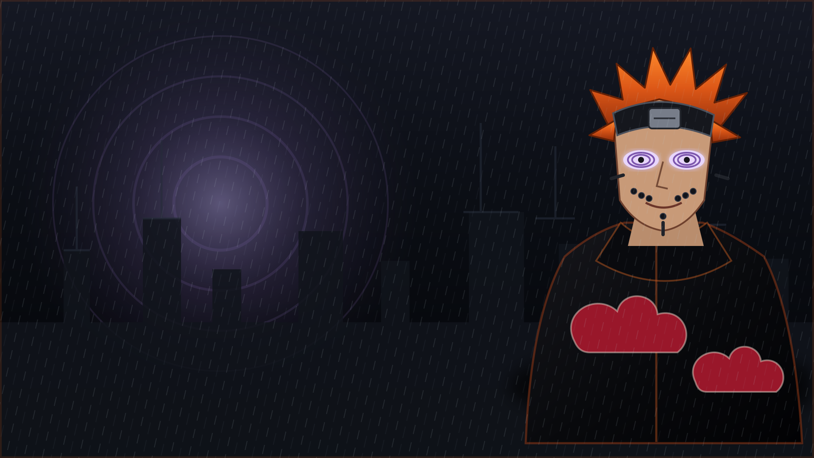

# Pain JIKKAI — BetterDiscord Theme

Tema completo para BetterDiscord inspirado em **Pain**, **Rinnegan**, **Akatsuki** e na organização **JIKKAI**.

A complete BetterDiscord theme inspired by **Pain**, the **Rinnegan**, the **Akatsuki**, and the **JIKKAI** organization.



## Recursos / Features

- Fundo original inspirado no Pain e na Vila da Chuva
- Símbolo JIKKAI de oito caudas
- Painéis pretos translúcidos com efeito de vidro
- Destaques em laranja, roxo Rinnegan e vermelho Akatsuki
- Estilos para servidores, canais, mensagens, reações, caixa de texto, menus, pop-outs, modais e configurações
- Contraste legível e controles principais preservados
- Compatibilidade com preferências de redução de movimento e transparência
- Sem rastreadores, analytics ou scripts
- Variáveis editáveis no início do arquivo CSS

## Instalação / Installation

1. Baixe o arquivo [`PainJikkai.theme.css`](PainJikkai.theme.css).
2. Abra o Discord.
3. Vá em **Configurações do usuário → BetterDiscord → Themes**.
4. Clique em **Open Themes Folder**.
5. Coloque o arquivo `PainJikkai.theme.css` nessa pasta.
6. Ative o tema **Pain JIKKAI**.

Pasta padrão no Windows:

```text
%appdata%\BetterDiscord\themes
```

## Personalização / Customization

Edite as variáveis da seção `PAIN JIKKAI — USER SETTINGS` no início do arquivo:

```css
--pj-orange: #d75b16;
--pj-rinnegan: #a786d8;
--pj-akatsuki: #b71832;
--pj-panel: rgba(8, 9, 13, 0.84);
--pj-blur: 12px;
--pj-logo-size: 235px;
--pj-logo-opacity: 0.12;
```

## BetterDiscord submission

O addon distribuído é o arquivo único:

```text
PainJikkai.theme.css
```

Mantenha esse caminho e nome estáveis depois da aprovação, pois mover ou renomear o arquivo pode interromper o rastreamento de atualizações do BetterDiscord.

## Créditos e aviso / Credits and disclaimer

Código do tema, arte vetorial de fundo e símbolo JIKKAI: **Ygor Fox / JIKKAI**.

Naruto, Pain, Akatsuki, Discord e BetterDiscord pertencem aos seus respectivos proprietários. Este é um tema de fã não oficial e não possui afiliação ou endosso dessas marcas.
